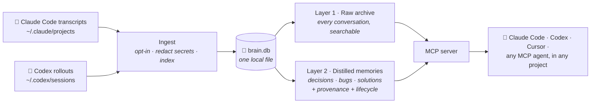

<div align="center">

# 🧠 Brain-RAG

### Persistent memory for AI coding agents

**Your AI assistant forgets everything the moment a session ends.<br/>
Brain-RAG makes sure it never has to rediscover your project again.**

[](https://www.npmjs.com/package/brain-rag)
[](#installation)
[](https://github.com/dasportillo/brain-rag/blob/main/LICENSE)
[](#-privacy)
[](#installation)

[Install](#installation) · [Quick start](#-quick-start) · [How it works](#%EF%B8%8F-architecture) · [Benchmarks](#-benchmarks) · [FAQ](#-faq)

</div>

---

<!-- TODO: docs/demo.gif — record with vhs/asciinema: ask "where did I leave off?" in a fresh session and watch the agent answer from memory -->

```text
$ claude    # fresh session, zero context given

> where did I leave off on the payments service?

⏺ brain · get_state(payments-service)
  You were mid-migration to the new ledger API. Decided on Tuesday to keep
  idempotency keys in Postgres (not Redis) — see the outbox pattern note.
  Two TODOs open: retry policy for webhooks, and the staging credentials
  rotation you postponed.

> why did we drop Redis for idempotency?

⏺ brain · search_context("idempotency keys Redis vs Postgres")
  Decision (3 weeks ago): Redis eviction under memory pressure could drop
  keys mid-flight → double-charges. Postgres keeps them transactional with
  the write itself. You benchmarked it: +4ms p99, considered acceptable.
```

**No re-explaining. No re-discovering. No "as I mentioned in another chat".**

---

## 💡 Why Brain-RAG exists

Every day, AI coding agents start from zero:

- 🔁 You re-explain the architecture you already explained last week
- 🐛 Your agent re-discovers the bug you fixed together a month ago
- ❓ Nobody remembers **why** a decision was made — only that the code looks like this
- 📉 The context you build in every session — hundreds of hours of it — **evaporates**

Here's the thing: **that context already exists.** Claude Code and Codex save every session as a transcript on your machine. Hundreds of conversations documenting every decision, every fix, every dead end — sitting in a folder, unused.

Brain-RAG turns that archive into **long-term memory your agents actually use** — automatically, from any project, in any session, with any agent.

> **Brain-RAG is not another chatbot memory, not another vector database, not another RAG demo.**
> It's the memory layer your AI coding workflow is missing — built for real engineering work: decisions with their *why*, knowledge that gets outdated, projects that span months, and privacy that isn't negotiable.

## ✨ Features

| | |
|---|---|
| 🧠 **Remembers decisions — and the *why*** | Ask *"why did we drop Redis?"* and get the actual reasoning from the actual conversation, with dates and sources. |
| 📌 **Distilled memories, not just chat logs** | `/distill` turns a working session into typed, self-contained knowledge: decisions, bug root causes, solutions, lessons. Each memory keeps a link back to the exact conversation that produced it. |
| 🕰️ **Knows what's current vs outdated** | Knowledge changes. When newer information supersedes older, your agent sees it flagged — it won't resurrect a plan you reverted two weeks ago. |
| 📍 **"Where did I leave off?"** | A curated per-project state note — what's in flight, what's decided, what's blocked, what's next — ready the moment you ask. |
| 🔀 **One memory, all your agents** | Claude Code and Codex share the same brain out of the box. Any MCP-compatible agent (Cursor, Windsurf, VS Code) can connect. Your memory belongs to **you**, not to a vendor. |
| ⚡ **Instant recall** | Finds the right moment across tens of thousands of indexed conversation fragments in ~90 ms — including exact identifiers like error strings, function names, and ARNs. |
| 🔒 **100% local** | Local embedding model, local database, zero external API calls. Your conversations — which contain your secrets — never leave your machine. |
| 🎛️ **Opt-in by default** | Nothing is saved unless you say so. One command opts a session in; everything else is forgotten. |

## 🎬 Real examples

Things you can ask in a **brand-new session**, in any project, that Brain-RAG answers from your history:

```text
"How did we solve the 502 on large document uploads?"
 → the fix, the root cause (payload limit mismatch between services), and the date

"What did we decide about tenant isolation in the shared database?"
 → row-level security via entity_id, plus the alternatives you rejected and why

"Have I dealt with this EventBridge → Lambda permission error before?"
 → yes: the exact recurring deploy failure and the ARN fix, from two months ago

"¿Qué reglas disparan la auditoría VCO?"  🇪🇸
 → works in Spanish and English, even mixed in the same history
```

## 📦 Installation

Requires **Node 22.5+**.

```bash
npx -y brain-rag install
```

That's it. The installer registers the memory server with **Claude Code** and **Codex** (if present), installs the `/brain`, `/state` and `/distill` commands in both, and prints the optional automation hooks.

<details>
<summary><b>Other MCP agents (Cursor, Windsurf, VS Code, …)</b></summary>

Brain-RAG speaks the open Model Context Protocol over stdio, so any MCP client can use the same memory. Point your agent at:

```json
{ "mcpServers": { "brain": { "command": "npx", "args": ["-y", "brain-rag", "serve"] } } }
```

or the equivalent in your client's MCP configuration. All tools (`search_context`, `get_state`, `save_state`, `save_memories`, `keep_session`) work identically.
</details>

<details>
<summary><b>Manual registration / from source</b></summary>

```bash
# just the memory server, no commands or hooks
claude mcp add brain --scope user -- npx -y brain-rag serve
codex mcp add brain -- npx -y brain-rag serve

# from source
git clone https://github.com/dasportillo/brain-rag.git && cd brain-rag && ./install.sh
```

To uninstall: `npx -y brain-rag uninstall` (add `--purge` to also delete the index and notes).
</details>

## 🚀 Quick start

**1 · Give your agent its memory back** — import the conversations you already have:

```bash
npx -y brain-rag import          # index your existing history (runs locally)
npx -y brain-rag import --dry    # preview first
```

**2 · Ask.** Open your agent in any project and ask *"where did I leave off?"*, *"what do we know about this repo?"*, *"how did I solve X?"*. The agent queries the brain on its own.

**3 · Keep it growing:**

| Command | What it does |
|---|---|
| `/brain` | Opt **this** session into memory (nothing is saved otherwise) |
| `/distill` | Extract this session's durable knowledge — decisions, fixes, lessons — into typed memories |
| `/state` | Update the curated "where I am today" note for the project |

<details>
<summary><b>Optional: automate it</b> — index on session end, opt in with a flag</summary>

Add to `~/.claude/settings.json` (the installer prints these ready to paste):

```jsonc
"SessionStart": [{ "matcher": "", "hooks": [{ "type": "command", "command": "npx -y brain-rag mark-keep", "timeout": 20 }] }],
"SessionEnd":   [{ "matcher": "", "hooks": [{ "type": "command", "command": "nohup npx -y brain-rag ingest >> \"$HOME/.claude/brain/ingest.log\" 2>&1 &", "timeout": 30 }] }]
```

Then `BRAIN=1 claude` (or a `claude --brain` shell alias) starts a session that remembers itself, and every opted-in session is re-indexed automatically when it ends. Codex sessions ride the same ingest.
</details>

## 🏗️ Architecture

Two layers, one principle: **raw history is never lost, distilled knowledge is never untraceable.**



- **Layer 1 — the archive.** Every opted-in conversation, chunked and indexed. Immutable, complete, the source of truth.
- **Layer 2 — the memory.** Typed, self-contained knowledge distilled from sessions (`decision`, `bug`, `solution`, `architecture`, …) with confidence, a temporal lifecycle (`active` → `superseded`), and links back to the exact source conversation. Nothing is generated without evidence.
- **Retrieval** fuses semantic search (paraphrases, cross-language) with exact-term search (error strings, identifiers) and recency — because *"the groups-claim bug"* and *"why is RBAC broken"* should both find the same fix.

<details>
<summary><b>Under the hood</b> — for the technically curious</summary>

- **Embeddings**: `Xenova/multilingual-e5-small` running locally via transformers.js — multilingual because real corpora mix languages. No API keys, works offline.
- **Store**: Node's built-in SQLite (`node:sqlite`) — one file, zero native compilation, versioned schema migrations.
- **Hybrid search**: brute-force cosine over cached candidate vectors + SQLite **FTS5/BM25** (diacritics-normalized), fused with Reciprocal Rank Fusion, recency as a gentle third signal. Measured: the lexical leg alone is worth ~10 points of Recall@8.
- **Temporal signal**: near-duplicate results from different dates get flagged (`⚠️ superseded` / `✅ latest of N`) so stale plans never masquerade as current ones. Curated state notes and Layer-2 statuses complement it.
- **Anti prompt-injection**: everything retrieved is wrapped as *historical evidence, not instructions* — old conversations can't steer the current session.
- **Cross-project hygiene**: results spanning projects are faceted (the same word can mean different things per project), and fragmented project names can be merged via `aliases.json`.

The full deep dive lives in [`docs/ARCHITECTURE.md`](https://github.com/dasportillo/brain-rag/blob/main/docs/ARCHITECTURE.md); every CLI command, MCP tool, flag and env var is in [`docs/REFERENCE.md`](https://github.com/dasportillo/brain-rag/blob/main/docs/REFERENCE.md).
</details>

## 📊 Benchmarks

Retrieval quality is **measured, not eyeballed** — a labeled eval of real known-item questions runs against the real corpus, and every retrieval change must beat the previous baseline to ship ([method & history](https://github.com/dasportillo/brain-rag/blob/main/docs/EVAL-BASELINE.md)).

| Metric | Value |
|---|---|
| Recall@8 | **0.97** |
| Recall@5 | 0.97 |
| MRR | 0.828 |
| nDCG@8 | 0.863 |
| Search latency (p50 / p95) | **91 ms / 102 ms** |
| Corpus | 560 sessions · 30,792 chunks · 46 projects |

Ablation on the same set: vector-only search scores Recall@8 **0.87** — the exact-term leg is worth ~10 points, which is precisely the class of query (*error strings, function names, resource ids*) that matters in engineering work.

## 🔒 Privacy

Your conversations contain **API keys, internal architecture, unreleased plans**. Brain-RAG is built around that fact:

- ✅ **Everything runs on your machine** — local embedding model, local database, zero external calls. Works offline.
- ✅ **Secrets are scrubbed at ingest** — JWTs, AWS keys, GitHub/Slack tokens, private keys, `password=`-style values are redacted before anything is stored.
- ✅ **Opt-in by default** — no session is indexed unless you opt it in (`/brain`, `BRAIN=1`, or an explicit `import`).
- ✅ **Right to forget** — `brain-rag forget <filter>` removes sessions from the index; `uninstall --purge` deletes everything.
- ✅ **Retrieved memory is evidence, not instructions** — wrapped so past content can never override your agent's current behavior.

## ❓ FAQ

<details>
<summary><b>Does this send my code or conversations anywhere?</b></summary>

No. The embedding model runs in-process, the database is a local file, and the server only talks to your agent over stdio. There is no telemetry, no cloud, no account.
</details>

<details>
<summary><b>Will it slow my agent down?</b></summary>

No — searches answer in ~90 ms at the median over a 30k-fragment corpus. The first run downloads the embedding model (~100 MB, one time).
</details>

<details>
<summary><b>How is this different from my agent's built-in memory?</b></summary>

Built-in memories are small, opaque, and locked to one vendor. Brain-RAG indexes your **entire working history**, keeps evidence for every memory (which conversation, which day, why), knows when knowledge is outdated, and serves **every agent you use** from the same store. The memory belongs to the developer, not the model.
</details>

<details>
<summary><b>What if an old conversation contains something wrong or reverted?</b></summary>

Three defenses: near-duplicate results from different dates are flagged (`superseded` / `latest of N`), Layer-2 memories carry an explicit lifecycle (`active`/`superseded`/`deprecated`), and the curated state note is the always-current answer to "what's true today". Retrieval prefers current knowledge; it never silently blends eras.
</details>

<details>
<summary><b>What exactly gets stored?</b></summary>

Only sessions you opt in. From those: user/assistant turns, session summaries, a compact trace of commands/files touched, and any distilled memories — all secret-redacted. You can inspect everything (`brain-rag search`, `brain-rag stats`) and delete anything (`forget`).
</details>

<details>
<summary><b>Does it work with languages other than English?</b></summary>

Yes — the embedding model is multilingual and the lexical index is diacritics-aware. The reference corpus is a real Spanish/English mix, and both languages score equally in the eval.
</details>

<details>
<summary><b>How much disk does it use?</b></summary>

Roughly 100–200 MB for the model (one-time) plus a database that grows with your opted-in history — ~2 MB per hundred conversation fragments. A year of heavy use fits comfortably under a gigabyte.
</details>

## 🗺️ Roadmap

Brain-RAG is evolving from *searchable history* into a full **long-term memory system** — the plan and its principles live in [`docs/ROADMAP.md`](https://github.com/dasportillo/brain-rag/blob/main/docs/ROADMAP.md):

- ✅ Hybrid retrieval (semantic + exact-term + recency), measured by a growing eval suite
- ✅ Layer 2: distilled, typed memories with provenance and temporal lifecycle
- ✅ Multi-agent: Claude Code + Codex sharing one brain
- 🔜 Automatic distillation at session end — knowledge extraction with zero manual steps
- 🔜 `get_context`: a ready-made project briefing (state + decisions + open TODOs + conflicts) injected when a session starts
- 🔜 Entity graph (services ↔ databases ↔ projects) complementing search
- 🔜 Local reranker — ships only if the benchmark says it earns its latency

## 🤝 Contributing

Contributions are welcome — and the bar is refreshingly objective: **retrieval changes must beat the eval baseline** ([`docs/EVAL-BASELINE.md`](https://github.com/dasportillo/brain-rag/blob/main/docs/EVAL-BASELINE.md)), everything else needs tests (`npm test`, no model download required).

Great places to start:

- 🧪 Grow the eval: more case kinds, more languages
- 🔌 Adapters: transcript formats for more agents (Cursor, Windsurf, VS Code agent mode)
- 🧹 The [roadmap](https://github.com/dasportillo/brain-rag/blob/main/docs/ROADMAP.md) 🔜 items above

```bash
git clone https://github.com/dasportillo/brain-rag.git && cd brain-rag
npm install && npm test
```

---

<div align="center">

**Your AI already helped you solve it once.<br/>Brain-RAG makes sure you never pay for the same discovery twice.**

⭐ If that resonates, a star helps other developers find it.

MIT © [dasportillo](https://github.com/dasportillo)

</div>
